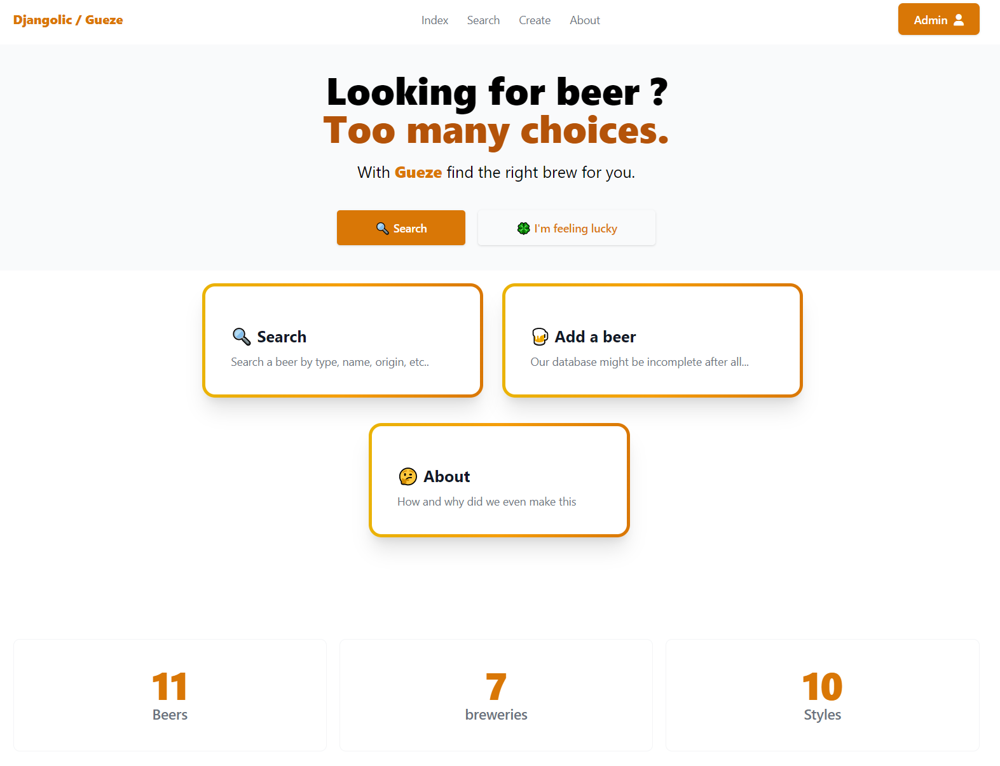

<div align="center">

# Djangolic


<a href="https://gitmoji.dev">

</a>

<a href="https://github.com/TheoGicquel/Djangolic/actions/workflows/CI.yml">

</a>

<a style="display:inline" href="https://wakatime.com/badge/github/TheoGicquel/Djangolic"></a>

</div>


A Django + Tailwind CRUD app to search and organize beers.


## Authors

- [@TheoGicquel](https://www.github.com/TheoGicquel) : **Frontend, Backend, Tests** - [View commits](https://github.com/TheoGicquel/Djangolic/commits?author=TheoGicquel) <a href="https://wakatime.com/badge/github/TheoGicquel/Djangolic"></a>
- [@Hazarel](https://www.github.com/Hazarel) ( AKA Maxime Joubert ) : **Tests** - [View commits](https://github.com/TheoGicquel/Djangolic/commits?author=Hazarel)
- [@Volpe08](https://github.com/Volpe08) ( AKA Fabien Rivet ) : **Model** -  [View commits](https://github.com/TheoGicquel/Djangolic/commits?author=Volpe08)

## Features

- Search for beers using different criterias
- Add / Delete / Modifiy beers
- Responsive design

## Screenshots



## Tech Stack

**Client:** Jinja + Tailwind CSS + Fontawesome Icons

**Server:** Django

**Testing/Build:** Nx (Nrwl) + Cypress

## Installation

Install all required dependencies and populate database

```bash
./install.sh
```

## Running Project

To build and deploy this project run :

```bash
  npx nx djangolic:build
  npx nx djangolic:serve
```

## Environment Variables

The following environment variables can be found in `/packages/djangolic/djangolic/.env`

- `NPM_BIN_PATH_WINDOWS`
- `SECRET_KEY`

## Running Tests

To run tests in a terminal, run the following command

```bash
    npx nx djangolic-e2e:e2e
```

If you wish to run tests in the interactive GUI provided by cypress, launch the following script :

```bash
    ./cypress.sh
```
